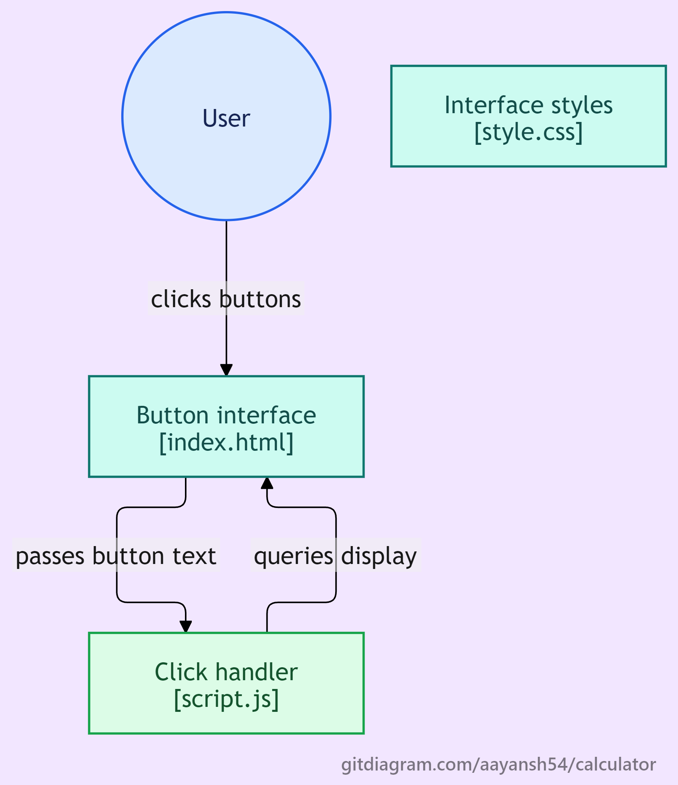

# Calculator

A simple, clean calculator built with vanilla **HTML, CSS, and JavaScript**. No frameworks or libraries, just the core web fundamentals.

## Preview

<!-- Add a screenshot of the running calculator here, e.g. assets/screenshot.png -->

## Flowchart

The flowchart below shows how the calculator handles input, from a button press to the result on the display.



## Features

- [x] Responsive dark-themed UI built with CSS Grid
- [x] Number buttons (0-9) and decimal point
- [x] Operator buttons (`+`, `-`, `*`, `/`)
- [x] Button hover and press animations
- [x] Read-only display that shows button input
- [ ] `C` button to clear the display
- [ ] `DEL` button to remove the last character
- [ ] `=` button to evaluate the expression

## Tech Stack

| Layer     | Technology                         |
| --------- | ---------------------------------- |
| Structure | HTML5                              |
| Styling   | CSS3 (Flexbox, Grid, transitions)  |
| Logic     | JavaScript (ES6, DOM manipulation) |

## Project Structure

```
calculator/
├── assets/
│   └── flowchart.png
├── index.html     # Calculator markup
├── style.css      # Layout and theme
├── script.js      # Button handling and calculator logic
└── README.md
```

## Getting Started

1. **Clone the repository**
   ```bash
   git clone https://github.com/Aayansh54/calculator.git
   ```
2. **Open the project folder**
   ```bash
   cd calculator
   ```
3. **Run it**: open `index.html` in any modern browser. No build step or dependencies required.

## How It Works

1. Every button inside `.buttons` gets a click listener in `script.js`.
2. On click, the button's text is passed to the `press()` function.
3. `press()` updates the value of the `#display` input based on which button was pressed.

## Roadmap

- Finish `C`, `DEL`, and `=` functionality
- Prevent invalid input (double operators, multiple decimals)
- Add keyboard support
- Handle divide-by-zero gracefully

## Author

**Aayansh Karna**
GitHub: [@Aayansh54](https://github.com/Aayansh54)

## License

This project is open source and available under the [MIT License](LICENSE).
